# 🚀 AI Smart CRM & Lead Qualifier

A fully automated **Sales Funnel** that captures leads, analyzes their intent using **Google Gemini AI**, and routes them to the correct follow-up sequence instantly.

> **Stop wasting time on cold leads. Let AI prioritize your sales pipeline.**

## 🌟 Overview

This system bridges the gap between Lead Capture and Sales Action. It replaces manual data entry and human filtering with an autonomous agent that works 24/7.

**The Workflow:**
1.  **Capture:** Client fills a branded form on [Tally.so](https://tally.so).
2.  **Store:** Data is instantly logged into **Airtable**.
3.  **Analyze:** **Gemini AI** reads the client's message to determine if they are **"Hot" (Ready to buy)** or **"Cold" (Just browsing)**.
4.  **Action:** The system routes the lead via **Gmail**:
    - 🔥 **Hot Leads:** Receive a direct VIP meeting invitation.
    - ❄️ **Cold Leads:** Receive a generic nurturing email.

## 🚀 Key Features

- **📝 Smart Forms:** Beautiful, high-converting forms using Tally.so.
- **🧠 AI Intent Analysis:** Uses LLMs to understand context, urgency, and budget from text.
- **🗂️ Relational Database:** Structured data storage in Airtable (better than Sheets).
- **🚦 Dynamic Routing:** Logic-based email sequences (Router Module).
- **⚡ Real-Time Processing:** Zero latency between submission and response.

## 🛠️ Tech Stack

- **Orchestration:** [Make.com](https://www.make.com/)
- **AI Brain:** Google Gemini API (2.5 Flash)
- **Database:** Airtable
- **Frontend:** Tally.so
- **Communication:** Gmail / SMTP
- ## ⚙️ How It Works (The Logic)

```mermaid
graph TD;
    A[User Fills Tally Form] -->|Webhook| B(Make.com Scenario);
    B --> C{Gemini AI Analysis};
    C -->|High Intent| D[Mark as HOT 🔥];
    C -->|Low Intent| E[Mark as COLD ❄️];
    D --> F[Update Airtable];
    E --> F;
    F --> G{Router};
    G -->|If Hot| H[Send VIP Offer Email];
    G -->|If Cold| I[Send 'Thank You' Email];
```

  ## 📸 Screenshots

### 1. The Logic (Make.com Scenario)
*(Place your Make scenario screenshot here)*

### 2. The Database (Airtable)
*(Place your Airtable grid view screenshot here)*

---

## 🔧 Installation / Setup

1.  **Clone the Repo:** Download the Blueprint JSON file above.
2.  **Import to Make:** Create a new scenario and import the blueprint.
3.  **Setup Accounts:**
    - Connect your **Airtable** API Key.
    - Connect **Google Gemini** API Key.
    - Connect **Gmail**.
4.  **Configure Tally:** Set up the webhook to point to your Make scenario.
5.  **Run:** Turn it on and watch the leads flow!

---
*Built with ❤️ by [YoussfEhab] - Automating the world, one task at a time.*
